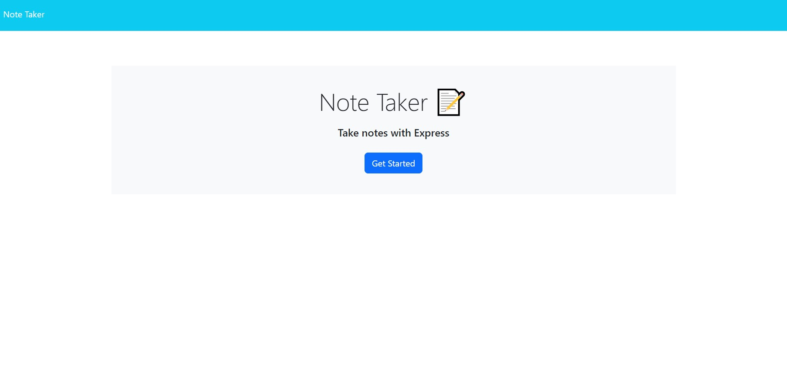
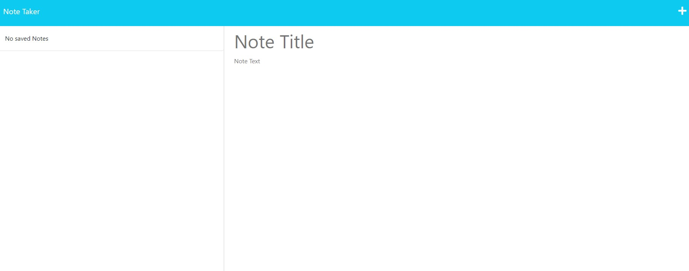
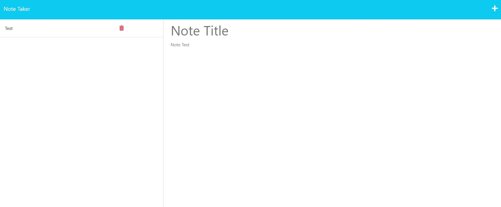

# Note Taker

## Description

I was motivated to create a project that allows a user to take notes and save them in a clean webpage. This project solves this goal and provides the ability for the user to delete any notes they no longer need too.

## Table of Contents

- [Installation](#installation)
- [Usage](#usage)
- [License](#license)
- [Questions and Contributing](#questions-and-contributing)
- [Tests](#tests)

## Installation

N/A

## Usage

When the user comes to the main webpage, they will first need to click "Get Started" to access the Note Taker page. Once the user comes to this page, on the right hand side, the user is presented with fields to enter in the title and the note text. Once the user is finished making their note, they can click the save button in the top right hand corner of the screen. Once this is done, the created note will show listed on the left side of the screen. The user can then click the delete / trashcan button to delete their note.

[Deployed Webpage](https://dry-castle-65219.herokuapp.com/)

## License

[The MIT License](https://opensource.org/licenses/MIT)

## Questions and Contributing

If you have any questions, you can contact me by [email](j.mcd.lungren@gmail.com) or through [GitHub](https://github.com/jmcdlungren).

If you are interested in contributing, please follow the guidelines outlined within the [Contributor Covenant](https://www.contributor-covenant.org/).

## Tests

N/A